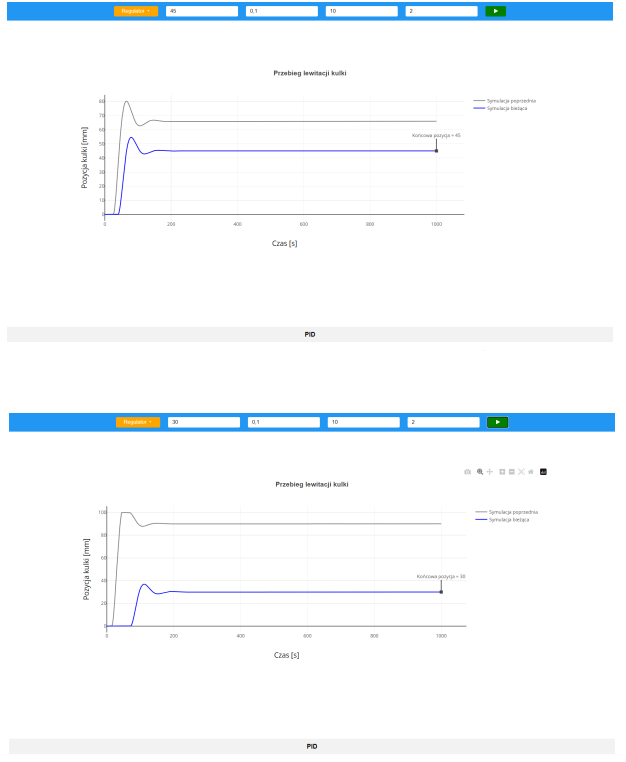

# PID vs Regulacja Rozmyta dla Symulacji Lewitującej Piłeczki w Tubie

## Opis projektu

Celem tego projektu jest stworzenie symulacji regulacji wysokości lewitującej piłeczki w tubie za pomocą dwóch różnych strategii regulacyjnych: PID oraz regulacji rozmytej PI. 
W tym przypadku, wartością sterującą jest prędkość obrotów wentylatora, a wartością sterowaną jest wysokość piłeczki w tubie.

## Funkcje Aplikacji

1. **Regulacja PID:**
   - Użytkownik może dostosowywać parametry regulatora PID, takie jak wzmocnienie, czas zdwojenia oraz czas wyprzedzania.
   - Możliwość zmiany wartości zadanej wysokości.

2. **Regulacja Rozmyta PI:**
   - Użytkownik ma możliwość zmiany jedynie wartości zadanej wysokości w przypadku regulacji rozmytej.
   
3. **Wykresy:**
   - Na wykresie wyświetlane są dwa przebiegi: bieżącej symulacji oraz poprzedniej symulacji. To pozwala porównać skuteczność obu strategii regulacyjnych.

## Zrzuty ekranu

